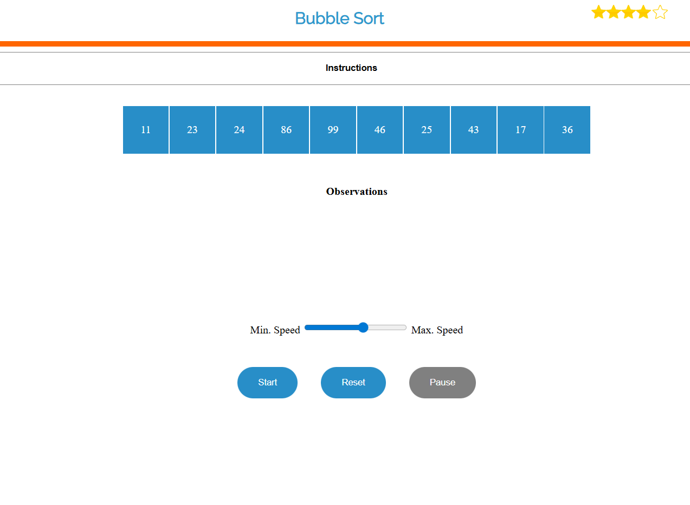
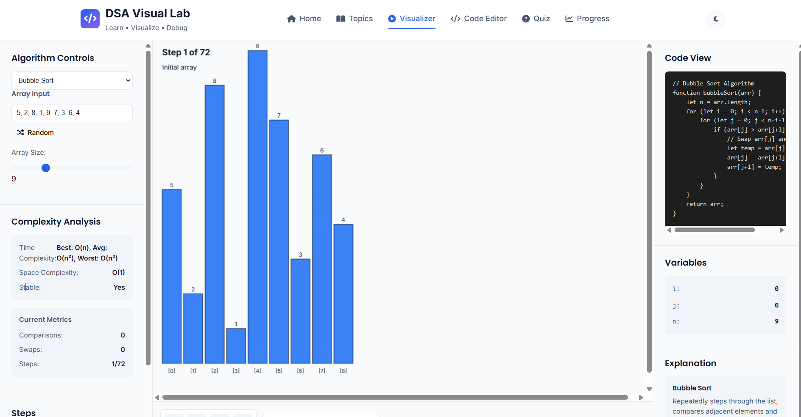
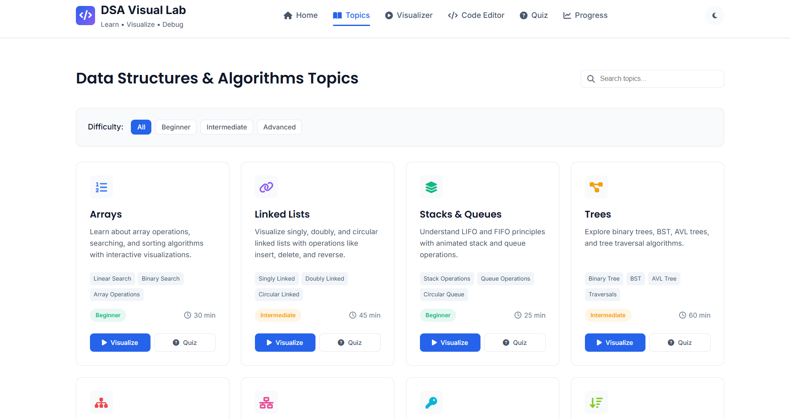
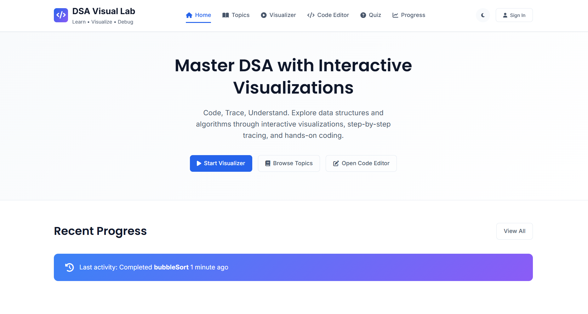
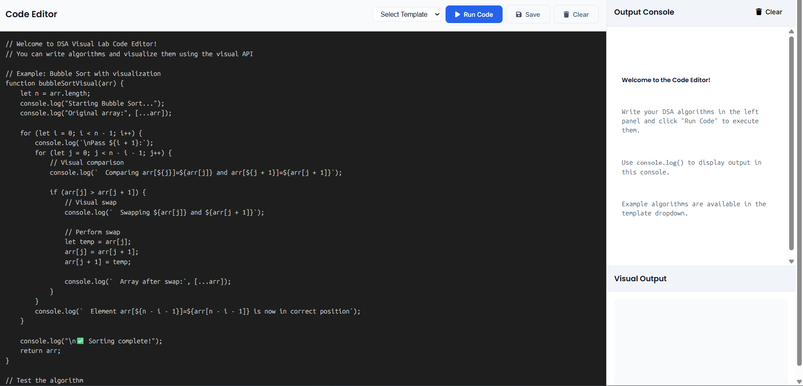
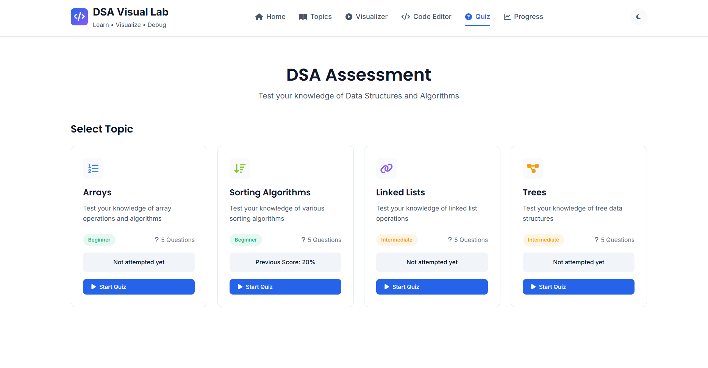
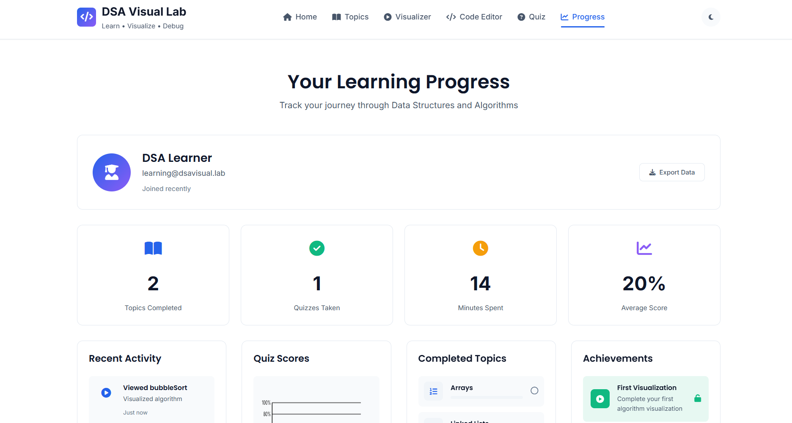
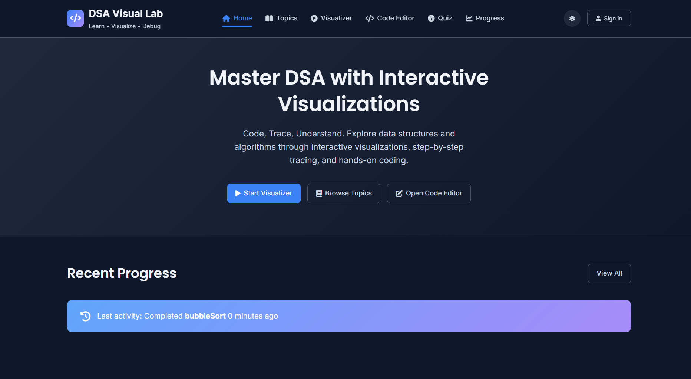

# DSA Visual Lab - Image Guide

Here's a table showing the different screens and features of the DSA Visual Lab application:

| Image | Description | Features Shown | Technologies Used |
|-------|-------------|----------------|-------------------|
|  | **Bubble Sort Visualization** | Interactive sorting visualization with array elements (11, 23, 24, 86, etc.), control buttons (Start, Reset, Pause), and speed controls | HTML5, CSS3, Vanilla JavaScript, Canvas API for visual elements |
|  | **Algorithm Control Panel** | Complete visualization interface with algorithm controls, complexity analysis, code view, variable tracking, step-by-step execution, and detailed explanations | HTML5, CSS3, JavaScript, Real-time DOM manipulation, Syntax highlighting |
|  | **Topics Overview** | All DSA topics organized by difficulty (Beginner/Intermediate/Advanced) including Arrays, Linked Lists, Stacks & Queues, Trees with estimated learning times | HTML5, CSS Grid/Flexbox, JavaScript for interactive UI components |
|  | **Homepage** | Main landing page with call-to-action buttons (Start Visualizer, Browse Topics, Open Code Editor) and recent progress tracking | HTML5, CSS3, JavaScript, Responsive design principles |
|  | **Code Editor** | Interactive coding environment with example algorithms (Bubble Sort shown), template selection, run/save/clear functionality, and output console | HTML5, CSS3, JavaScript, Code execution sandbox, Console simulation |
|  | **Assessment/Quiz Interface** | DSA assessment section with topic-based quizzes (Arrays, Sorting Algorithms, Linked Lists, Trees), difficulty levels, and previous scores | HTML5, CSS3, JavaScript, Local Storage for score tracking |
|  | **Learning Progress Dashboard** | User progress tracking showing quizzes taken, topics completed, time spent, achievements, and recent activity | HTML5, CSS3, JavaScript, Local Storage API, Progress tracking logic |
|  | **Enhanced Homepage** | Updated homepage with improved recent progress tracking showing last activity timestamp | HTML5, CSS3, JavaScript, Time formatting utilities |

---

## Detailed Descriptions

###  - Bubble Sort Visualization
This screen shows the core visualization feature where users can watch Bubble Sort algorithm in action. The array elements are displayed visually, and users can control the animation speed, pause, reset, or start the sorting process.

###  - Algorithm Control Panel
A comprehensive interface for algorithm visualization featuring real-time complexity analysis, side-by-side code view with highlighting, variable state tracking, and step-by-step execution controls. This is the main educational tool for understanding algorithm behavior.

###  - Topics Overview
The learning catalog that organizes DSA topics by difficulty level. Each topic card shows subtopics, estimated learning time, and quick access to visualization and quiz features.

###  - Homepage
The main entry point of the application with primary navigation options and a brief overview of recent user activity. Designed to be clean and inviting for new users.

###  - Code Editor
An interactive coding workspace where users can write, run, and test their own DSA implementations. Includes template algorithms, real-time output console, and visual feedback for code execution.

###  - Assessment Interface
The quiz/testing section where users can evaluate their knowledge on specific DSA topics. Tracks previous scores and provides targeted practice based on performance.

###  - Progress Dashboard
A personalized dashboard showing learning statistics, achievements, recent activities, and overall progress. Helps users track their learning journey and stay motivated.

###  - Enhanced Homepage
An updated version of the homepage with more detailed progress tracking, showing precise timestamps of recent activities and improved user engagement features.

---

## Technology Stack

### Frontend Technologies
- **HTML5**: Semantic markup for all application screens
- **CSS3**: Styling, animations, and responsive design
- **Vanilla JavaScript**: Core application logic without external frameworks
- **Canvas API**: For algorithm visualizations and animations
- **Local Storage API**: For persisting user progress and settings
- **DOM Manipulation**: Real-time UI updates and interactive elements

### Key Features Implementation
1. **Algorithm Visualization**: Custom JavaScript animation engine with step-by-step execution control
2. **Code Execution**: JavaScript sandbox for safe code running
3. **Progress Tracking**: Local storage-based persistence system
4. **Responsive Design**: Mobile-first CSS approach
5. **Interactive UI**: Event-driven JavaScript components
6. **Data Management**: Client-side state management for user data

### Development Approach
- **No External Dependencies**: Pure HTML/CSS/JavaScript implementation
- **Modular Design**: Separated visualization engine, UI components, and data layer
- **Educational Focus**: Clear explanations, variable tracking, and complexity analysis
- **User-Centric**: Progress tracking, achievements, and personalized learning paths
